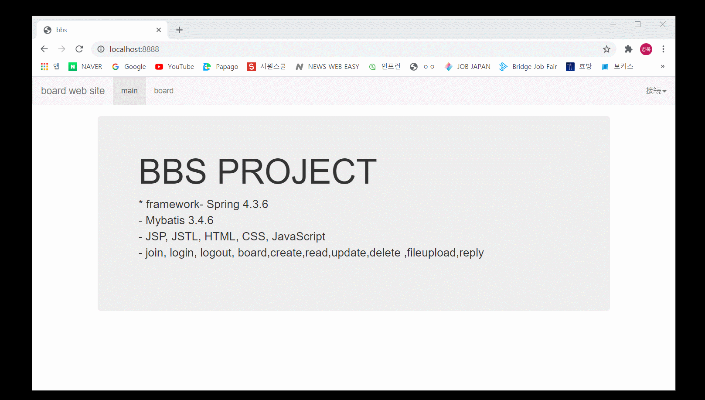
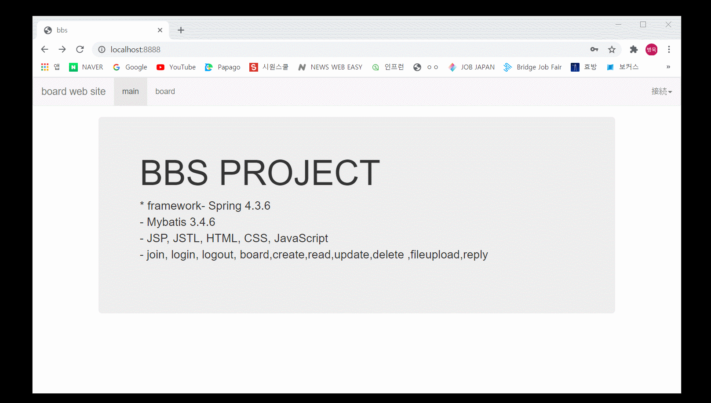
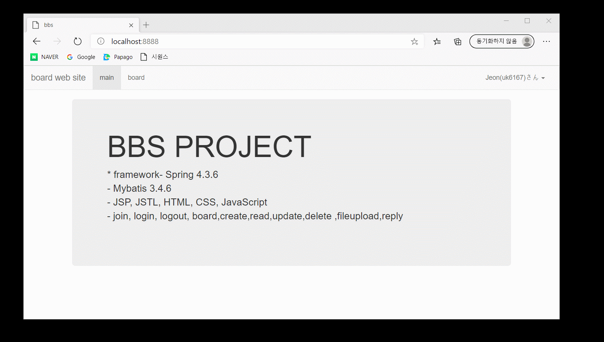
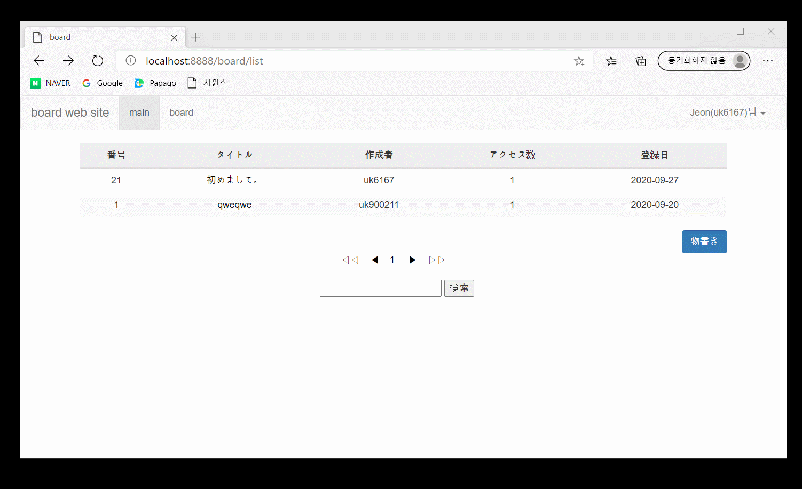
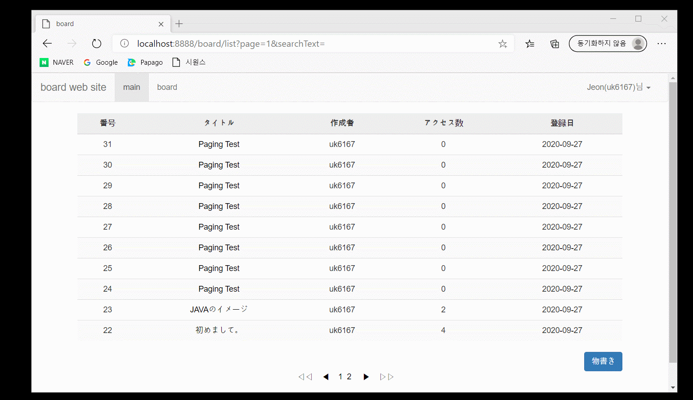

# 返信掲示板システム
## 製作動機
- どのようなwebでもboardは必ず必要です。
- 新入開発者の基本だと思います。
- それで、たくさんの練習で早くboardを作ることを目標にしたプロジェクトです。

## プロジェクト要求事項

- boardのwebsiteには、userという1種類のuserだけがいます。
- userは会員加入をすることができます。
- userはログインできます。
- ログインに成功すると、画面右上に会員の名前、IDが出力されます。
- userは、boardで書き込みを作成することができ、自分が書いた書き込みでのみ修正、削除することができます。

- userは検索ができます。
## 開発環境

**front-end**
- bootstrap

**back-end**
- spring 4.3.6
- jdk1.8
- oracle
- mybatis 3.4.6
- tomcat 9
- maven 2.9

## front-end  開発環境、選択理由

私はウェブデザイナーではありません。
ですから、デザインフレームワークの**bootstrap**を使いました。

## back-end 開発環境、選択理由

実際の現場で使うものを使ってみたいので
**spring、mybatis、oracle**などを選択しました。

## NBBSパッケージ構造

# join

# login

# board_create

# board_reda

# board_update

# board_delete

# reply_create

# board_search

## 作ってからの感じ

私は学校ではjdbcプログラミングだけ習いましたが、
今回、mybatisを使いながらsqlとjavaコードを分離して
もっと書きやすいコードにしてくれるのを感じました。

## 補完点

ID重複チェックなどの様々な有効性チェック
